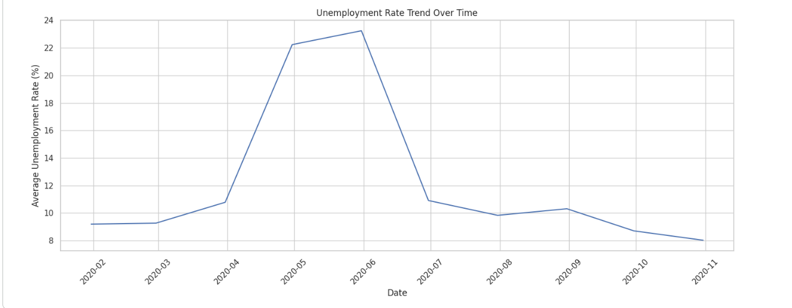
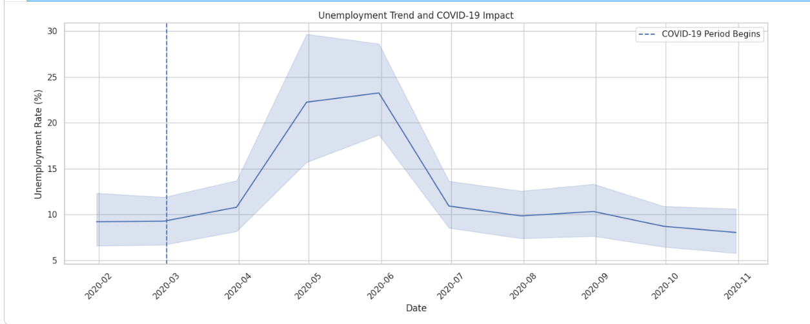
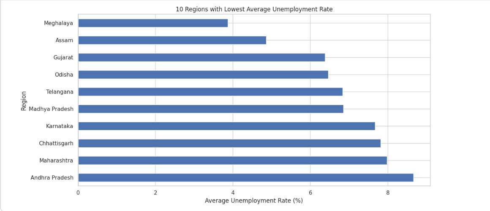

# Unemployment Analysis with Python

### CodeAlpha Data Science Internship — Task 2

## Project Overview

This project focuses on analyzing unemployment rate data in India using
Python.

The analysis explores unemployment trends over time, regional
variations, seasonal patterns, and the impact of the COVID-19 pandemic.

The project demonstrates the use of Python-based data cleaning,
exploratory data analysis, statistical analysis, and visualization.

---

## Objectives

- Analyze unemployment trends over time
- Clean and preprocess unemployment data
- Investigate the impact of COVID-19
- Compare unemployment rates across regions
- Analyze Rural vs Urban unemployment
- Identify seasonal patterns
- Study the relationship between unemployment and labour participation
- Generate meaningful economic and social insights

---

## Technologies Used

- Python
- Pandas
- NumPy
- Matplotlib
- Seaborn
- Google Colab
- GitHub

---

## Dataset

The project uses an unemployment dataset containing information about
unemployment rates across different regions of India.

### Main Features

| Feature | Description |
|---|---|
| Region | Indian state or region |
| Date | Date of observation |
| Frequency | Frequency of data collection |
| Estimated Unemployment Rate (%) | Percentage of unemployed people |
| Estimated Employed | Estimated number of employed people |
| Estimated Labour Participation Rate (%) | Labour participation percentage |
| Area | Rural or Urban classification |

---

## Analysis Performed

### 1. Data Cleaning
- Removed unnecessary spaces from column names
- Checked missing values
- Checked duplicate records
- Converted date values into datetime format

### 2. Exploratory Data Analysis
- Statistical summary
- Unemployment distribution
- Average unemployment rate
- Minimum and maximum unemployment rates

### 3. Time-Series Analysis
Analyzed unemployment rate changes over time.

### 4. COVID-19 Impact Analysis
Compared unemployment levels before and during the COVID-19 period.

### 5. Regional Analysis
Compared average unemployment rates across regions.

### 6. Rural vs Urban Analysis
Analyzed unemployment differences between rural and urban areas.

### 7. Seasonal Analysis
Analyzed monthly unemployment patterns.

### 8. Correlation Analysis
Examined the relationship between unemployment rate and labour
participation rate.

---
## 📊 Project Visualizations

### 1. Unemployment Rate Distribution


This chart shows the distribution of unemployment rates across the dataset.

---

### 2. Unemployment Rate Trend Over Time



This chart shows how unemployment rates changed over time.

---

### 3. COVID-19 Impact on Unemployment



This visualization highlights changes in unemployment during the COVID-19 period.

---

### 4. Regional Unemployment Analysis


This visualization compares unemployment levels across different regions.

---

### 5. Regions with Low Unemployment



This chart highlights regions with relatively lower unemployment rates.

---

### 6. Rural vs Urban Unemployment


This visualization compares unemployment rates between urban and rural areas.

---

### 7. Seasonal Unemployment Analysis


This chart examines monthly variations and possible seasonal patterns in unemployment.

---

### 8. Unemployment vs Labour Participation


This visualization examines the relationship between unemployment rate and labour participation rate.
## Key Findings

The analysis revealed differences in unemployment rates across regions
and significant changes during the COVID-19 period.

The dataset also showed variations in unemployment across different
months and geographic areas.

The relationship between unemployment and labour participation was
also analyzed to provide additional insight into labour-market
conditions.

> Numerical findings are calculated directly from the dataset in the
> project notebook.

---

## Policy Insights

The analysis suggests that:

- Employment programs can be targeted toward regions experiencing
  persistently high unemployment.
- Skill-development and reskilling initiatives can improve
  employability.
- Rural and urban employment policies should account for their
  different labour-market conditions.
- Economic support programs can be strengthened during periods of
  major economic disruption.
- Regular unemployment monitoring can help identify emerging
  employment problems.

---

## Project Structure

```text
CodeAlpha_Unemployment_Analysis/
│
├── Unemployment_Analysis_with_Python.ipynb
├── README.md
└── images/
